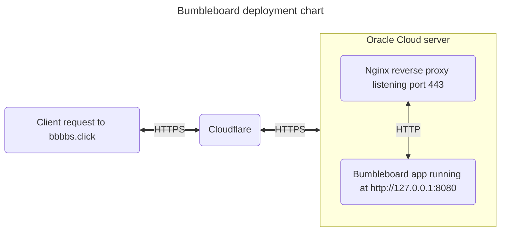

# Bumbleboard

Simple BBS-like single page app written with Go

## Project description
I wanted to write simple BBS-style web app using only basic Golang packages. For the "frontend" part I used Bootstrap 5.

## [Live version](https://bbbbs.click/)

## How to run locally
Just `go run bbs.go` and open http://127.0.0.1:8080

## Deployment scheme

## Credits
Bumblebee background image by <a href="https://pixabay.com/users/nekomachines-19125993/?utm_source=link-attribution&amp;utm_medium=referral&amp;utm_campaign=image&amp;utm_content=6395170">nekomachines</a> from <a href="https://pixabay.com//?utm_source=link-attribution&amp;utm_medium=referral&amp;utm_campaign=image&amp;utm_content=6395170">Pixabay</a>

## TODO
- [x] Write some tests
- [x] Add systemd service file
- [x] Add Github Actions workflow file
- [ ] Split codebase to several files

## History
- 2023-03-30 Beginning of development
- 2023-04-05 First public version released at https://bbbbs.click
- 2023-04-06 Disallow empty posts
